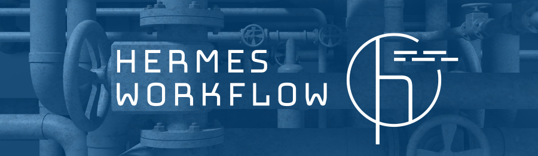

<!--
SPDX-FileCopyrightText: 2022 German Aerospace Center (DLR), Forschungszentrum Jülich

SPDX-License-Identifier: CC-BY-SA-4.0
-->

<!--
SPDX-FileContributor: Stephan Druskat
SPDX-FileContributor: Michael Meinel
SPDX-FileContributor: Oliver Bertuch
-->



# hermes

Implementation of the HERMES workflow. For more extensive documentation, see the [HERMES workflow documentation](https://docs.software-metadata.pub/en/latest).

(For more information about the HERMES [HMC](https://helmholtz-metadata.de) *project*, see the [HERMES project website](https://software-metadata.pub).)

[](https://www.repostatus.org/#wip)
[](https://sonarcloud.io/summary/new_code?id=hermes-hmc_workflow)


## Installation and Usage

`hermes`' primary use case is to [use it in a continuous integration environment](https://docs.software-metadata.pub/en/latest/tutorials/automated-publication-with-ci.html).

In case you still want to install on your machine, you can (for example) use `pip`:

```commandline
pip install git+https://github.com/hermes-hmc/workflow.git
```

- Note: you must have Python 3.10 or newer installed.
- Note: we plan to release stable versions to PyPI (and potentially Github Packages) in the future.

The `hermes` application provides the entry point for the HERMES workflow.
After installation, you can run it from your command line environment:

```shell
hermes --help
hermes harvest
```

You can also call the `hermes` package as a Python module:

```shell
python -m hermes --help
python -m hermes harvest
```

## Contributions, Extension and Development

We welcome external contributions! Please follow our [contribution guidelines](CONTRIBUTING.md).

HERMES was designed with extensibility in mind. Our [development guide](https://docs.software-metadata.pub/en/latest/dev/start.html)
contains in-depth information on how to get ready and start coding.

## Acknowledgements

This project (ZT-I-PF-3-006) was funded by the *Initiative and Networking Fund*
of the [Helmholtz Association](https://www.helmholtz.de/en/about-us/structure-and-governance/initiating-and-networking)
in the framework of the [Helmholtz Metadata Collaboration](https://helmholtz-metadaten.de)'s
[2020 project call](https://helmholtz-metadaten.de/en/projects/hmc-projects-2020).

## License and Citation

Please see [`LICENSE.md`](LICENSE.md) for legal information.
We provide a [`CITATION.cff`](CITATION.cff) containing all metadata for citation, which is also easy to
use via the widget on the right-hand side.
