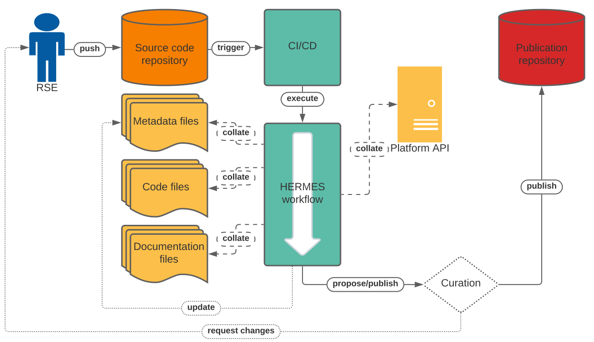

<!--
SPDX-FileCopyrightText: 2022 Forschungszentrum Jülich, German Aerospace Center (DLR)

SPDX-License-Identifier: CC-BY-SA-4.0
-->

<!--
SPDX-FileContributor: Oliver Bertuch
SPDX-FileContributor: Stephan Druskat
SPDX-FileContributor: Michael Meinel
-->


# Overview

```{warning}
This is a work in progress. Expect disruptive changes.
```

Research software must be formally published to satisfy FAIR principles and unlock academic credit. Publication
repositories enable this and provide PIDs for software versions, but only through tedious, mostly manual process. 

The HERMES workflow enables automated publication of rich research software metadata and artifacts to publication
repositories using open source tooling. 

We follow a *push based* model and run in continuous integration (CI) infrastructures integrated in common code platforms 
such as GitHub or GitLab to avoid going out of service and overcome limitations of pull-based web services. 

Rich descriptive metadata is the key element to useful software publications. We harvest existing metadata from source
code repos and connected platforms, then process, collate and present them for curation, thus preparing software for
automatic submission to publication repositories. 



## Documentation
 
<!--
```{toctree}
 cli
```
-->

```{toctree}
:glob:
:maxdepth: 1
:caption: Tutorials
tutorials/*
```

```{toctree}
:maxdepth: 1
:caption: Developers
dev/contribute
Tutorial: Get started w/ development <dev/start>
dev/data_model
adr/index
api/index
```

```{toctree}
:hidden:
:caption: Related
Project Website <https://project.software-metadata.pub>
Concept Paper <https://arxiv.org/abs/2201.09015>
```

## Feedback

This is an open repository to collect feedback on the HERMES workflow.

We see our project as part of a global and inter-disciplinary effort to improve the state of the art in 
research software engineering, maintenance and scholarly communications around research software. We therefore
appreciate any feedback you may have on the HERMES project itself and any of its outputs.

**How to give feedback**

Either [create an issue](https://github.com/hermes-hmc/workflow/issues/new/choose) in our project repository or 
[send us an email](mailto:team@software-metadata.pub?subject=HERMES%20WOrkflow%20Reachout).

## Acknowledgements

This project (ZT-I-PF-3-006) was funded by the *Initiative and Networking Fund*
of the [Helmholtz Association](https://www.helmholtz.de/en/about-us/structure-and-governance/initiating-and-networking)
in the framework of the [Helmholtz Metadata Collaboration](https://helmholtz-metadaten.de)'s
[2020 project call](https://helmholtz-metadaten.de/en/projects/hmc-projects-2020).

```{include} ../../LICENSE.md
```

## Indices and tables

* [](genindex)
* [](modindex)
* [](search)