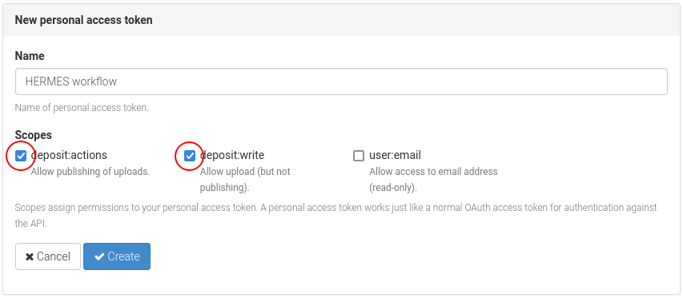
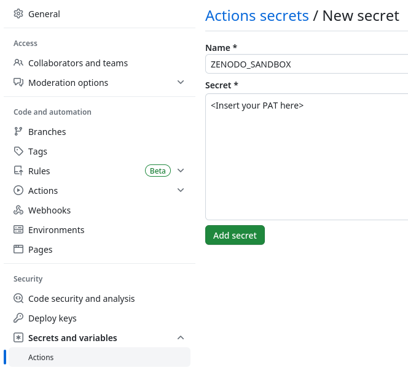
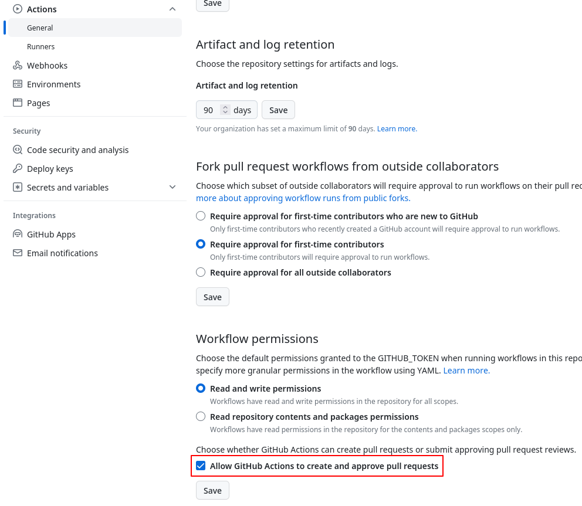

<!--
SPDX-FileCopyrightText: 2023 German Aerospace Center (DLR), Forschungszentrum Jülich GmbH

SPDX-License-Identifier: CC-BY-SA-4.0
-->

<!-- 
SPDX-FileContributor: Oliver Bertuch
SPDX-FileContributor: Michael Meinel
SPDX-FileContributor: Stephan Druskat
SPDX-FileContributor: Sophie Kernchen
-->

# Set up automatic software publishing
 
```{note}
This tutorial works for repositories hosted on GitHub or GitLab, and shows how to automatically publish to 
[Zenodo Sandbox](https://sandbox.zenodo.org). Zenodo Sandbox is a "toy" repository that can be used to try things out.

This tutorial should also work with the "real" [Zenodo](https://zenodo.org).
```
 
## Configure your .gitignore
 
The HERMES workflow (`hermes`) uses temporary caches in `.hermes/`.
Ignore this directory in your git repository.

Add `.hermes/` to your `.gitignore` file:
 
```{code-block} bash
:caption: .gitignore

.hermes/
```

## Provide additional metadata using CITATION.cff
 
To provide high-quality citation metadata for your project and your publication,
provide a `CITATION.cff` file in the [Citation File Format](https://citation-file-format.github.io/).

If you don't have one yet,
use the [cffinit](https://citation-file-format.github.io/cff-initializer-javascript/) website
to create a `CITATION.cff` file.

```{important}
Make sure that you define the [license](https://spdx.org/licenses/) for your repository [in the `CITATION.cff` file](https://github.com/citation-file-format/citation-file-format/blob/main/schema-guide.md#license)! Otherwise, Zenodo Sandbox will not accept your publication as open access.
```

Save the `CITATION.cff` file to the root directory of your repository, and add it to version control.

```bash
git add CITATION.cff
git commit -m "Add citation file"
git push
```
 
## HERMES configuration
 
The HERMES workflow is configured in a [TOML](https://toml.io) file: `hermes.toml`.
Each step in the publication workflow has its own section.

Configure HERMES to:

- harvest metadata from Git and `CITATION.cff`
- deposit on Zenodo Sandbox (which is built on the InvenioRDM)
- use Zenodo Sandbox as the target publication repository

```{code-block} toml
:caption: hermes.toml
:name: hermes.toml

[harvest]
from = [ "git", "cff" ]

[deposit]
target = "invenio"

[deposit.invenio]
site_url = "https://sandbox.zenodo.org"
access_right = "open"

[postprocess]
execute = [ "config_record_id" ]
```

Copy this file to the root directory of your repository and add it to version control:

```bash
git add hermes.toml
git commit -m "Configure HERMES to harvest git and CFF, and deposit on Zenodo Sandbox"
git push
```

```{note}
If you decide to start from an existing `hermes.toml` (e.g., the one found in this repository),
be sure that there is no `record_id` value defined in the `deposit.invenio` section.
Otherwise, your deposition will fail as *hermes* would try to deposit a new version for the given record.
```

## Get a personal access token for Zenodo Sandbox

To allow GitHub Actions to publish your repository to Zenodo Sandbox for you,
you need a personal access token from Zenodo Sandbox.

Log in at [Zenodo Sandbox](https://sandbox.zenodo.org) (you may have to register first).

Then [create a new personal access token in your user profile](https://sandbox.zenodo.org/account/settings/applications/tokens/new/)
with the scopes `deposit:actions` and `deposit:write`.

```{toggle}

```

Keep the generated token somewhere from where you can easily retrieve it later on (e.g., a password safe).

## Configure continuous integration build to use `hermes`

The following instructions differ depending on whether you are using GitHub actions or GitLab CI for your
development workflow.

To support this, the HERMES project provides templates for continuous integration systems in a dedicated repository:
[hermes-hmc/ci-templates](https://github.com/hermes-hmc/ci-templates).


### Configure a GitHub Action to automate publication 

Copy the Zenodo sandbox token you just created into a new [GitHub Secret](https://docs.github.com/en/actions/security-guides/encrypted-secrets#creating-encrypted-secrets-for-a-repository)
called `ZENODO_SANDBOX` in your repository.

```{toggle}

```

Copy the [template file for GitHub to Zenodo Sandbox publication](https://github.com/hermes-hmc/ci-templates/blob/main/TEMPLATE_hermes_github_to_zenodo.yml)
into the `.github/workflows/` directory in your repository, and rename it as you like (e.g. `hermes_github_to_zenodo.yml`).

Go through the file, and look for comments marked with `# ADAPT`. Adapt the file to your needs.

If you need help with how GitHub Action workflows work in general, have a look at the 
[Github Actions documentation](https://docs.github.com/actions).

Add the workflow file to version control and push it:
```bash
git add .github/workflows/hermes_github_to_zenodo.yml
git commit -m "Configure automatic publication with HERMES"
git push
```

```{note}
If you haven't adapted the workflow file and push it to the branch `main`, the HERMES workflow will run for the first time. This will create a new pull request with compiled metadata for curation. You can safely close it at this point.
```

#### Allow GitHub Actions to create pull requests in your repository

The automated HERMES workflow will not publish any metadata without your approval.
It will instead create a pull request for you to approve or change the metadata that is being deposited.
To do this, GitHub Actions needs to be able to create pull requests in your repository.

To enable this, go to *Settings* > *Actions* > *General* in your repository,
and activate the option "Allow GitHub Actions to create and approve pull requests" in the section *Workflow permissions*.

```{toggle}

```

### Configure GitLab CI to automate publication

Copy the Zenodo sandbox token you just created into a new [GitLab CI variable](https://docs.gitlab.com/ee/ci/variables/#for-a-project)
called `ZENODO_TOKEN`.

For Gitlab you also need the HERMES Push Token. That Token gives access to the project in order for HERMES to create Merge Requests.
Therefore, you [create an access token in your project](https://docs.gitlab.com/ee/user/project/settings/project_access_tokens.html#create-a-project-access-token).
The Token needs to have at least the `developer` role and `write` access (e.g. write_repository scope).
Then you create a Gitlab CI variable with the token called `HERMES_PUSH_TOKEN`.

```{note}
The two Gitlab CI Variables include sensitive and powerful information.
Therefore you should at least select the flag `Mask variable` when creating.
If possible you should also select the flag `Protect variable` and define all branches `hermes/*` as
protected branch.
```

Copy the [template file for GitLab to Zenodo Sandbox publication](https://github.com/hermes-hmc/ci-templates/blob/main/gitlab/hermes-ci.yml)
into your project to `.gitlab/hermes-ci.yml`.

To integrate the workflows into your `.gitlab-ci.yml`, you need to add the following:

```{code-block} yaml
:caption: .gitlab-ci.yml

# Use jobs defined by the HERMES GitLab template  
include:
  - .gitlab/hermes-ci.yml

# Run the first half of the pipeline, resulting in a Merge Request for curation
hermes_curate:
  extends:
    - .hermes_curate

# Run the second half, resulting in a new deposition and a Merge Request with post-processing results
hermes_deposit:
  extends:
    - .hermes_deposit
```

If you need help with how GitLab CI works in general, have a look at the 
[GitLab CI documentation](https://docs.gitlab.com/ee/ci/).

Add the template file and changes in the `gitlab-ci.yml` to version control and push it:

```bash
git add .gitlab/hermes-ci.yml
git add .gitlab-ci.yml
git commit -m "Configure automatic publication with HERMES"
git push
```

By default, the first part of the workflow (i.e., `.hermes_curate`)
will run on every new push during the *deploy* stage.

```{note}
If you haven't adapted the workflow file and push it to the branch `main`, the HERMES workflow will run for the first time.
This will create a new merge request with compiled metadata for curation. You can safely close it at this point.
```


## Automatic publication workflow

````{margin}
```{mermaid}
flowchart TD
    t(("Trigger\nGitHub Action\n(e.g. push)"))
    rh("Run hermes")
    subgraph "hermes (harvest, process, curate)"
    ci1("Harvest & process metadata")
    pr1("Create curation pull request")
    end
    d{"Merge?"}
    subgraph "hermes (deposit, postprocess)"
    ci2("Publish software")
    pp("Postprocessing")
    pr2("Create pull request\nfrom postprocessing")
    ci3("Cleanup")
    end
    e((("End")))
    t --> rh --> ci1 --> pr1 --> d -->|Merge| ci2 --> pp --> pr2 --> e
    d -->|Close| ci3 --> e
```
````

```{admonition} Congratulations!
You can now automatically publish your repository to Zenodo Sandbox!
```

Now the HERMES workflow is ready to run.
If you haven't adapted the workflow file, it will be triggered whenever you push to your `main` branch.

The diagram to the right shows the different steps that will happen each time.

When the workflow runs, it harvests and processes the metadata from Git and your `CITATION.cff` file,
and creates a new pull request in your repository.
You then have the chance to curate the metadata, i.e., make sure that it looks the way you want.
If you merge this pull request, a new publication is created on Zenodo Sandbox. 
In postprocessing, a new pull request is opened to update the HERMES configuration file
in your repository
with the ID of the publication.
This is needed so that future published versions are collected under the same [*concept DOI*](https://help.zenodo.org/#versioning).
